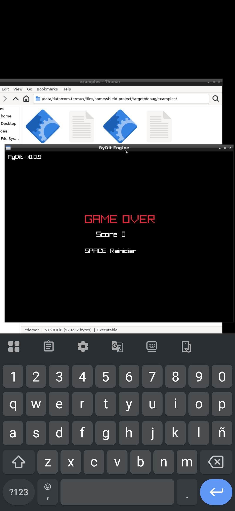
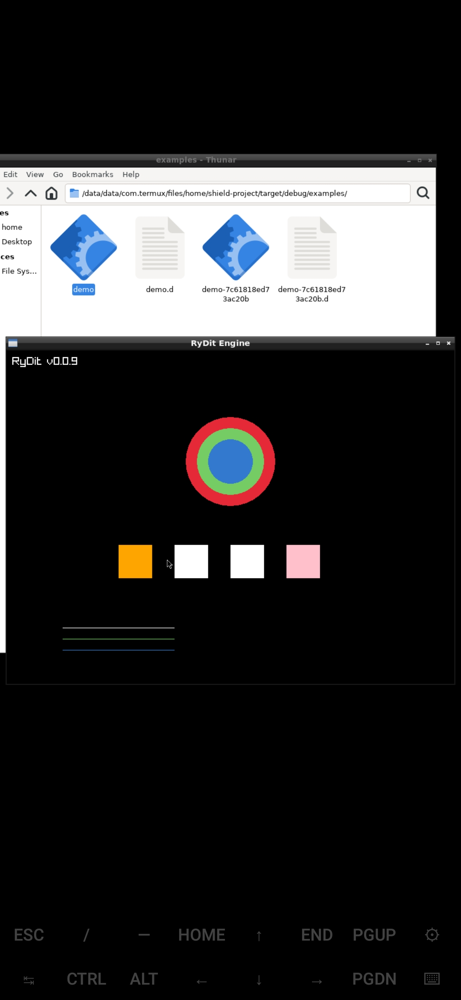
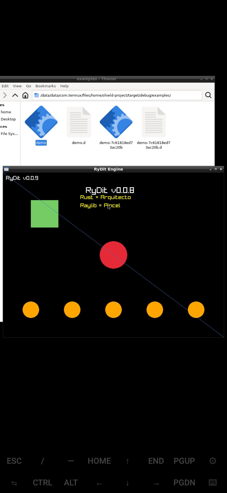

# 🛡️ RyDit - Motor de Videojuegos 2D + Lenguaje de Scripting en Rust para Android/Termux

<div align="center">


**"David vs Goliat - Un motor de videojuegos en Rust, construido 100% en un Redmi Note 8"**

[](https://github.com/lapumlbb18-blip/Rydit_Engine)
[](https://github.com/lapumlbb18-blip/Rydit_Engine)
[](https://www.rust-lang.org/)
[](https://www.raylib.com/)
[](https://github.com/lapumlbb18-blip/Rydit_Engine)
[](https://github.com/lapumlbb18-blip/Rydit_Engine/blob/main/LICENSE)

[📖 Documentación](#-documentación) • [🎮 Demo Snake](#-snake-game---demo-funcional) • [🚀 Roadmap](#-roadmap) • [📱 Construido en Android](#-construido-en-androidtermux) • [💬 Comunidad](#-comunidad)

</div>

---

## 🎯 ¿Qué es RyDit?

**RyDit** es un **motor de videojuegos 2D con lenguaje de scripting** escrito en **Rust** con **raylib**, diseñado para ejecutarse nativamente en **Android/Termux** sin necesidad de desktop, emuladores o IDEs pesados.

**No es solo un lenguaje** - es un motor completo con:
- 🎮 Game loop integrado
- 🎨 Renderizado gráfico (círculos, rectángulos, líneas, texto)
- 🎹 Input de teclado en tiempo real
- 🎲 Sistema de módulos (math, arrays, strings, io, random, time, json)
- 🧪 110 tests automáticos
- 📦 Snake Game completo como demo

```rydit
# Tu primer juego en RyDit (3 líneas)
shield.init
ryda frame < 1000 {
    draw.circle(400, 300, 50, "rojo")
}
```

| Característica | RyDit | Godot | Love2D | PICO-8 |
|---------------|-------|-------|--------|--------|
| **Android Native** | ✅ Sí (Termux) | ❌ No | ❌ No | ❌ No |
| **Lenguaje** | RyDit (Español) | GDScript | Lua | Lua |
| **Backend** | Rust | C++ | C | C |
| **Binario** | ~735 KB | ~50 MB | ~10 MB | ~5 MB |
| **Sin IDE** | ✅ Sí | ❌ Requiere editor | ⚠️ VS Code | ⚠️ Editor propio |
| **Game Loop** | ✅ Integrado | ✅ Integrado | ✅ Integrado | ✅ Integrado |

---

## 🎮 Snake Game - Demo Funcional

<div align="center">



*Snake Game completo con game loop, colisiones, puntuación y game over screen*

</div>

### Características del Snake
- ✅ **Cuerpo de serpiente** con arrays dinámicos
- ✅ **Comida aleatoria** con `random::int()`
- ✅ **Colisiones** con paredes y propio cuerpo
- ✅ **Puntuación** + high score
- ✅ **Velocidad progresiva**
- ✅ **Game Over** + restart con SPACE
- ✅ **Pausa** con P
- ✅ **Salir** con ESC

### Ejecutar Snake
```bash
# En Termux (Android)
cargo run --bin rydit-rs -- --gfx snake.rydit

# O con binario directo
./target/release/rydit-rs --gfx snake.rydit
```

### Controles
| Tecla | Acción |
|-------|--------|
| `↑` `→` `↓` `←` | Mover serpiente |
| `P` | Pausa |
| `SPACE` | Reiniciar |
| `ESC` | Salir |

---

## 🎨 Demo Visual - Formas y Colores

<div align="center">



*Demo de formas geométricas con draw.circle(), draw.rect(), draw.line(), draw.text()*

</div>

---

## 📸 Galería de Capturas

<div align="center">

### 🎮 Tank Combat Demo v0.3.0

| Tank Combat | Tanque con Torreta |
|--------------|--------------|
|  |  |
| Tanque verde con seguimiento de mouse | Torreta rotando hacia el objetivo |

| Campo de Batalla |
|--------------|
|  |
| Grid táctico con balas y colisiones |

---

### 🖥️ Migui GUI v0.4.1 - Immediate Mode GUI

| Migui Backend |
|--------------|
|  |
| **Immediate Mode GUI con backend raylib** - Botones, slider, checkbox, textbox, ventana arrastrable |

---

### 🤖 Rybot Asistente

| Rybot Interface |
|--------------|
|  |
| **Asistente de código RyDit** - Menú de comandos y ayuda interactiva |

---

### 🐍 Snake Game

| Snake Gameplay | Game Over |
|--------------|--------------|
|  |  |
| Snake en movimiento, grid retro, comida roja | Pantalla de Game Over, puntuación, high score |

</div>

**Todas las capturas fueron tomadas en un Redmi Note 8 con Termux-X11 + raylib** 📱🎮

```rydit
shield.init

ryda frame < 500 {
    draw.circle(400, 200, 80, "rojo")
    draw.rect(200, 350, 60, 60, "naranja")
    draw.line(100, 500, 300, 500, "blanco")
    draw.text("Demo RyDit", 250, 50, "amarillo")
}
```

---

## 📖 Sintaxis del Lenguaje

### Funciones Básicas
```rydit
rytmo saludar {
    voz "Hola Mundo"
    return 1
}

saludar()
```

### Funciones con Parámetros
```rydit
rytmo saludar(nombre) {
    voz "Hola " + nombre
}

saludar("Mundo")
```

### Condicionales
```rydit
dark.slot x = 10
onif x > 5 voz "Mayor" blelse voz "Menor"
```

### Ciclos
```rydit
dark.slot x = 3
ryda x {
    voz x
    dark.slot x = x - 1
}
```

### Arrays
```rydit
# Array básico
dark.slot lista = [1, 2, 3]

# Multidimensional (tablero)
dark.slot tablero = [[0, 0, 0], [0, 0, 0], [0, 0, 0]]

# Asignación por índice
dark.slot lista[0] = 5
```

### Sistema de Módulos
```rydit
# Importar módulos
import math
import arrays
import strings

# Usar funciones con namespace
dark.slot suma = math::sumar(10, 3)
dark.slot len = arrays::length([1, 2, 3])
dark.slot upper = strings::upper("hola")
```

### Gráficos (Modo Ventana)
```rydit
shield.init

# Dibujar formas
draw.circle(400, 300, 50, "rojo")
draw.rect(100, 100, 100, 100, "verde")
draw.line(0, 0, 800, 600, "azul")
draw.text("RyDit v0.1.9", 300, 50, "blanco")
```

---

## 🏗️ Arquitectura

```
┌─────────────────────────────────────────────────────────┐
│  RyDit Core (Rust)                                      │
│  ├── lizer       → Lexer + Parser + AST (~2,452 líneas) │
│  ├── blast-core  → Executor + Memoria (~465 líneas)     │
│  ├── rydit-gfx   → Gráficos raylib (~481 líneas)        │
│  ├── rydit-rs    → Binario + stdlib (~2,491 líneas)     │
│  └── v-shield    → Wrapper raylib (~120 líneas)         │
└─────────────────────────────────────────────────────────┘
         │
         ▼
┌─────────────────────────────────────────────────────────┐
│  Scripts RyDit (.rydit)                                 │
│  ├── Snake Game                                         │
│  ├── Demos visuales                                     │
│  ├── Módulos stdlib (math, arrays, strings, io, etc.)   │
│  └── Juegos de la comunidad                             │
└─────────────────────────────────────────────────────────┘
```

### Métricas del Proyecto
```
Líneas totales:     ~9,420 líneas
├── Rust:           ~7,200 líneas
└── RyDit:          ~2,220 líneas (demos + módulos + tests)

Tests automáticos:  93 pasando ✅
Demos funcionales:  14/14 ✅
Warnings activos:   0 ✅

Binarios:
├── rydit-rs:       ~835 KB (release)
└── snake:          ~494 KB

Crates:
├── lizer:          Lexer + Parser + AST (~2,452 líneas)
├── blast-core:     Executor + Memoria (~465 líneas)
├── rydit-gfx:      Gráficos raylib (~560 líneas)
├── rydit-rs:       Binario + stdlib (~2,500 líneas)
├── v-shield:       Wrapper raylib (~120 líneas)
└── migui:          Immediate Mode GUI (~600 líneas)
```

---

## 📱 Construido en Android/Termux

<div align="center">

| Setup | Especificaciones |
|-------|-----------------|
| **Dispositivo** | Redmi Note 8 |
| **OS** | Android 11 |
| **Terminal** | Termux |
| **RAM** | 4 GB |
| **Almacenamiento** | 64 GB |
| **IDE** | Ninguno (vim/nano) |
| **Teclado** | Pantalla táctil + Bluetooth |

</div>

**Este proyecto fue construido 100% en un teléfono Android**, sin laptop, sin desktop, sin IDE. Solo:
- 📱 Teléfono Redmi Note 8
- ⌨️ Terminal Termux
- 🦀 Rust + Cargo
- 🎨 Raylib (nativo)

**Filosofía:** Demostrar que el desarrollo serio es posible en dispositivos móviles cuando tienes arquitectura clara, tests automatizados, buena documentación y determinación.

---

## 🚀 Roadmap

<div align="center">

| Versión | Estado | Features Principales | Fecha |
|---------|--------|---------------------|-------|
| **v0.0.1-v0.0.14** | ✅ | CLI → Snake Game | 2026-03-14 a 2026-03-16 |
| **v0.1.0** | ✅ | Snake Game Completo | 2026-03-17 |
| **v0.1.1** | ✅ | Sistema de Módulos | 2026-03-17 |
| **v0.1.4** | ✅ | Strings + IO + Arrays | 2026-03-18 |
| **v0.1.6** | ✅ | Random + Time | 2026-03-18 |
| **v0.1.8** | ✅ | Maduración + Gráficos | 2026-03-20 |
| **v0.1.9** | ✅ | **110 Tests Checkpoint** | 2026-03-20 |
| **v0.2.0** | ✅ | Module System Avanzado + CI/CD | 2026-03-21 |
| **v0.3.0** | ✅ | Tank Combat + Colisiones + Math | 2026-03-21 |
| **v0.4.0** | ✅ | **migui** (Immediate Mode GUI ~600 líneas) | 2026-03-22 |
| **v0.4.1** | ✅ | **migui backend raylib** (renderizado real) | 2026-03-22 |
| **v0.5.0** | 🔜 | **Ecosistema Maduro** (integración) | Próxima |
| **v0.6.0** | 🔮 | **Motor de Escenas** (nodos, señales) | 2-3 meses |
| **v1.0.0** | 🔮 | Production Ready | 4-6 meses |

</div>

---

## 🎯 Estado del Proyecto

### ✅ Completado (v0.4.1)
- [x] Lexer + Parser con AST
- [x] Executor con memoria y scopes
- [x] Sistema de módulos (import)
- [x] 93 tests automáticos
- [x] 14 demos funcionales
- [x] Snake Game completo
- [x] Gráficos con raylib
- [x] Strings, IO, Arrays maduros
- [x] Soporte JSON
- [x] Random + Time ligeros
- [x] UTF-8 completo
- [x] Escapes en strings
- [x] Símbolos en identificadores
- [x] Tank Combat + colisiones
- [x] **migui** (Immediate Mode GUI ~600 líneas)
- [x] **migui backend raylib** (renderizado real 60 FPS)

### 🔜 Próximamente (v0.5.0 - v1.0.0)
- [ ] Más widgets (dropdown, listbox, progress bar)
- [ ] Layout automático (vertical, horizontal, grid)
- [ ] Estilos y temas personalizables
- [ ] Ecosistema maduro (integración con otras herramientas)
- [ ] Motor de escenas (nodos, señales, prefabs)
- [ ] Editor visual de escenas
- [ ] Ecosistema de frameworks (RPG, platformer)
- [ ] Asset store comunitario

---

## 🧪 Evaluación de la Comunidad

Este proyecto está siendo revisado por la comunidad de desarrolladores. Las evaluaciones detalladas de asistentes de IA se incluirán en la próxima actualización cuando el repositorio sea público.

> **"Espero tu evaluación de este proyecto con buena intención. Es mostrar lo que se hace en un celular gama baja, y que a futuras versiones con su apoyo, osea la comunidad, crezca en ecosistema con la capacidad enorme de la comunidad, para que creen sus escenas en hardware modesto sin depender de IA que hace un video rápido y sin experiencia propia. Esa es una de las claves."**

---

## 💬 Comunidad

### 🌐 Únete y Evalúa este Proyecto

| Plataforma | Enlace |
|-----------|--------|
| **Discord Mouredev** | https://discord.gg/mouredev |
| **Reddit r/rust** | https://reddit.com/r/rust |
| **Reddit r/gamedev** | https://reddit.com/r/gamedev |
| **Reddit r/AndroidGaming** | https://reddit.com/r/AndroidGaming |
| **X (Twitter)** | #RyDit #RustLang #AndroidDev |

### 💌 Tu Opinión Importa

¿Qué piensas de este proyecto? ¿Crees que es posible crear un motor de videojuegos completo en un celular gama baja?

**Tu evaluación ayuda a:**
- 📱 Demostrar que el desarrollo en Android es posible
- 🤝 Construir una comunidad que comparte conocimiento real
- 🎮 Crear un ecosistema donde todos pueden hacer sus juegos
- 🚀 Inspirar a otros con hardware modesto

### 🔜 Próximamente

- **Servidor Discord propio** - Espacio dedicado para RyDit
- **Evaluaciones públicas de IA** - Análisis detallado del código
- **Asset store comunitario** - Frameworks, escenas, herramientas

### 🤝 Contribuciones

¡Las contribuciones son bienvenidas! Lee [CONTRIBUTING.md](CONTRIBUTING.md) para más detalles.

```bash
# Clonar repositorio
git clone https://github.com/alucard18/shield-project.git

# Build
cd shield-project
cargo build

# Tests
cargo test

# Ejecutar demo
cargo run --bin rydit-rs -- --gfx demo_shapes.rydit
```

---

## 📚 Documentación

| Documento | Descripción |
|-----------|-------------|
| **[README.md](README.md)** | Documentación técnica interna |
| **[LIBRO_RYDIT.md](LIBRO_RYDIT.md)** | Guía completa del lenguaje (~400 líneas) |
| **[ROADMAP.md](ROADMAP.md)** | Planificación detallada |
| **[CONTRIBUTING.md](CONTRIBUTING.md)** | Guía de contribuciones |
| **[CHANGELOG_v0.1.8.md](CHANGELOG_v0.1.8.md)** | Cambios de versión |
| **[diagnostico/](diagnostico/)** | Logs de desarrollo (25 sesiones) |

---

## 🎮 Ejemplos de la Comunidad

### RPG Simple
```rydit
import rpg::engine

rytmo juego {
    rpg.iniciar("mi_rpg.rydit")
    rpg.crear_personaje("heroe", ["espada", "escudo"])
    rpg.iniciar_dialogo("npc", ["Hola", "Adiós"])
}
```

### Platformer
```rydit
import platformer::physics

platformer.fisica.gravedad(9.8)
dark.slot jugador = platformer.crear_jugador(100, 200)

ryda frame < 10000 {
    platformer.mover(jugador, "derecha")
    onif platformer.colision(jugador, "suelo") {
        platformer.saltar(jugador)
    }
}
```

### Visual Novel
```rydit
shield.init

dark.slot nombre = input("¿Cómo te llamas?")

ryda frame < 500 {
    draw.text("Hola " + nombre, 200, 100, "blanco")
    draw.text("¿Qué haces hoy?", 200, 200, "blanco")
    
    onif gui.button("Estudiar", 100, 300, 200, 50) {
        draw.text("¡Buena decisión!", 200, 400, "verde")
    }
}
```

---

## 🏆 Logros

### Sesión v0.4.1 - Migui Backend Raylib
- ✅ **Migui con renderizado real** (backend raylib funcional)
- ✅ **93 tests pasando** (sin regresiones)
- ✅ **0 warnings, 0 errors**
- ✅ **14/14 demos funcionales**
- ✅ **60 FPS** en game loop migui
- ✅ **~220 líneas Rust** agregadas

### General
- ✅ **30+ sesiones en 9 días** (v0.0.1 → v0.4.1)
- ✅ **6 crates funcionales**
- ✅ **~9,420 líneas de código**
- ✅ **Documentación completa**
- ✅ **GitHub público** (Rydit_Engine)

---

## 💾 Backup

- **Google Drive:** `alucard18:/shield-project-rydit`
- **Backup Histórico:** `alucard18:/shield-project-rydit-historial` (archivos antiguos)
- **Archivos:** 150+
- **Tamaño:** ~200 KB (sin `target/`)
- **Última sync:** 2026-03-22 (v0.4.1)

---

## 📄 Licencia

MIT License - Ver [LICENSE](LICENSE) para más detalles.

---

## 🙏 Agradecimientos

- **Comunidad Mouredev** - Discord: https://discord.gg/mouredev - Por el apoyo y espacio para compartir proyectos
- **raylib** (https://www.raylib.com/) - Por la biblioteca gráfica más ligera y fácil de usar
- **Rust** (https://www.rust-lang.org/) - Por el lenguaje más amado por 8 años consecutivos
- **Termux** - Por hacer posible el desarrollo en Android sin root

---

<div align="center">

## 🚀 "Construido con ❤️ en Android/Termux"

**"No necesitas una laptop cara para crear software impresionante. Solo necesitas un teléfono, determinación y mucha café."** ☕

**"Este proyecto es una invitación a la comunidad: miren lo que se puede hacer en un celular gama baja. Mi sueño es que a futuras versiones, con su apoyo, crezcamos en ecosistema. Que todos puedan crear sus escenas y juegos en hardware modesto, sin depender de herramientas que hacen todo rápido pero sin experiencia propia. Esa es la clave: aprender creando, no solo consumiendo."**

---

*¿Quieres evaluar este proyecto?* Únete al **Discord Mouredev**: https://discord.gg/mouredev y comparte tu opinión en #mostrar-proyecto

*Próxima actualización:* v0.5.0 con ecosistema maduro y más widgets migui

*Última actualización:* 2026-03-22 (v0.4.1 - Migui Backend Raylib)
*Próxima versión:* v0.5.0 (Ecosistema Maduro)
*Estado:* ✅ **93 TESTS - 0 WARNINGS - MIGUI FUNCIONAL**

[⬆️ Volver arriba](#-rydit---rust-gaming--scripting-engine-for-androidtermux)

</div>
